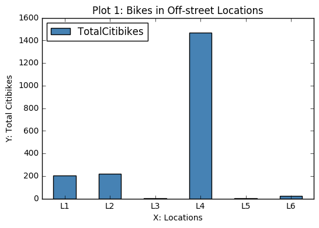

# Review Plot_akp418 from Zhaohong (zn352) 

Legend for the above Locations:

L1 : East River Esplanade at E Houston St.

L2 : East River Greenway at E Houston St.

L3 : Route 9A Esplanade at 11th St.

L4 : Route 9A Greenway at 11th St.

L5 : Route 9A Greenway at 125th St.

L6 : Route 9A Greenway at 80th St.

## Review - 
Your plot is clear and precise – with properly x, y labels and title to address the situation of CitiBike distribution in different off-street locations. It's considerate to include an explanation of the street name that “L1-L6” represent. Also straightforward - let readers focus on L4 (around 1500) and by contrast L3&L5 (barely any). However, since the sequence of X:locations are not casual, it may be better to sort the location according to the height of the bars, ascending or descending. Another improvement is – as your plot is as good as a descriptive one, adding a visualization of another variable, e.g. the area of location, may provide readers a further understanding of big difference between L4 and L3/L5. 

